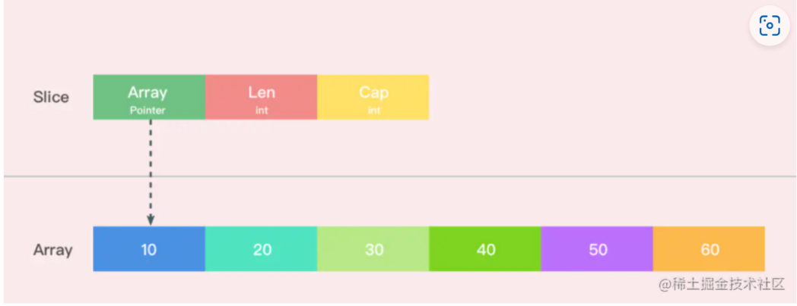

## slice

> 我们知道数组是固定长度的，slice可以理解为是在数组上的加强，我们可以不设定切片的长度，不过最好还是事先预估好一个值预先分配，这样可以防止底层的疯狂扩容。

### slice底层结构



```go
type slice struct{
  array unsafe.Pointer
  len int
  cap int
}
```

切片的结构体由3部分组成，Pointer是指向一个数组的指针，len代表当前切片的长度，cap是当前切片的容量，cap总是大于等于len的。cap就是可以预分配底层数组的容量值，len是前几个值可以设为存在，可以进行修改s[0-len-1]，不会造成空指针

如果想从slice中得到一块内存地址可以这样做

```go
s := make([]byte,200)
ptr := unsafe.Pointer(&s[0])
```

### slice创建

```go
func makeslice(et *_type,len,cap int)slice{
  //根据切片的数据类型，获取切片的最大容量
  maxElements := maxSliceCap(et.size)
  //比较切片的长度，长度值在【0，maxElements】之间
  if len < 0 || uintptr(len) > maxElements {
    panic(errorString("makeslice : len out of range"))
  }
  //比较切片容量，容量值域在【len,maxElements】之间
  if cap < len || uintptr(cap) > maxELements{
    panic(errorString("makeslice : cap out of range"))
  }
  //根据切片的容量申请内存
  p := mallocgc(et.size*uintptr(cap),et,true)
  //返回申请好的切片的首地址
  return slice{p,len,cap}
}
```


### slice扩容

```go
func growslice(et *_type,old slice,cap int)slice{
  if raceenabled {
		callerpc := getcallerpc(unsafe.Pointer(&et))
		racereadrangepc(old.array, uintptr(old.len*int(et.size)), callerpc, 		funcPC(growslice))
	}
	if msanenabled {
		msanread(old.array, uintptr(old.len*int(et.size)))
	}
  
  if et.size == 0 {
		// 如果新要扩容的容量比原来的容量还要小，这代表要缩容了，那么可以直接报panic了。
		if cap < old.cap {
			panic(errorString("growslice: cap out of range"))
		}
		// 如果当前切片的大小为0，还调用了扩容方法，那么就新生成一个新的容量的切片返回。
		return slice{unsafe.Pointer(&zerobase), old.len, cap}
	}
  
  // 这里就是扩容的策略
	newcap := old.cap
	doublecap := newcap + newcap
	if cap > doublecap {
		newcap = cap
	} else {
		if old.len < 1024 {
			newcap = doublecap
		} else {
			// Check 0 < newcap to detect overflow
			// and prevent an infinite loop.
			for 0 < newcap && newcap < cap {
				newcap += newcap / 4
			}
			// Set newcap to the requested cap when
			// the newcap calculation overflowed.
			if newcap <= 0 {
				newcap = cap
			}
		}
	}
  
  // 计算新的切片的容量，长度。
	var lenmem, newlenmem, capmem uintptr
	const ptrSize = unsafe.Sizeof((*byte)(nil))
	switch et.size {
	case 1:
		lenmem = uintptr(old.len)
		newlenmem = uintptr(cap)
		capmem = roundupsize(uintptr(newcap))
		newcap = int(capmem)
	case ptrSize:
		lenmem = uintptr(old.len) * ptrSize
		newlenmem = uintptr(cap) * ptrSize
		capmem = roundupsize(uintptr(newcap) * ptrSize)
		newcap = int(capmem / ptrSize)
	default:
		lenmem = uintptr(old.len) * et.size
		newlenmem = uintptr(cap) * et.size
		capmem = roundupsize(uintptr(newcap) * et.size)
		newcap = int(capmem / et.size)
	}
  
  // 判断非法的值，保证容量是在增加，并且容量不超过最大容量
	if cap < old.cap || uintptr(newcap) > maxSliceCap(et.size) {
		panic(errorString("growslice: cap out of range"))
	}
  
  var p unsafe.Pointer
	if et.kind&kindNoPointers != 0 {
		// 在老的切片后面继续扩充容量
		p = mallocgc(capmem, nil, false)
		// 将 lenmem 这个多个 bytes 从 old.array地址 拷贝到 p 的地址处
		memmove(p, old.array, lenmem)
		// 先将 P 地址加上新的容量得到新切片容量的地址，然后将新切片容量地址后面的 capmem-newlenmem 个 bytes 这块内存初始化。为之后继续 append() 操作腾出空间。
		memclrNoHeapPointers(add(p, newlenmem), capmem-newlenmem)
	} else {
		// 重新申请新的数组给新切片
		// 重新申请 capmen 这个大的内存地址，并且初始化为0值
		p = mallocgc(capmem, et, true)
		if !writeBarrier.enabled {
			// 如果还不能打开写锁，那么只能把 lenmem 大小的 bytes 字节从 old.array 拷贝到 p 的地址处
			memmove(p, old.array, lenmem)
		} else {
			// 循环拷贝老的切片的值
			for i := uintptr(0); i < lenmem; i += et.size {
				typedmemmove(et, add(p, i), add(old.array, i))
			}
		}
	}
	// 返回最终新切片，容量更新为最新扩容之后的容量
	return slice{p, old.len, newcap}
}
```

上述的代码一是扩容的策略是首先判断如果新申请容量（cap）大于2倍的旧容量（old.cap），最终容量（newcap）就是新申请的容量（cap），否则判断当长度小于1024时是扩容到原来的2倍，大于1024时是扩容到原来的1.25倍，二是扩容生成的全新内存地址还是在原来的地址后追加的。

### slice查找