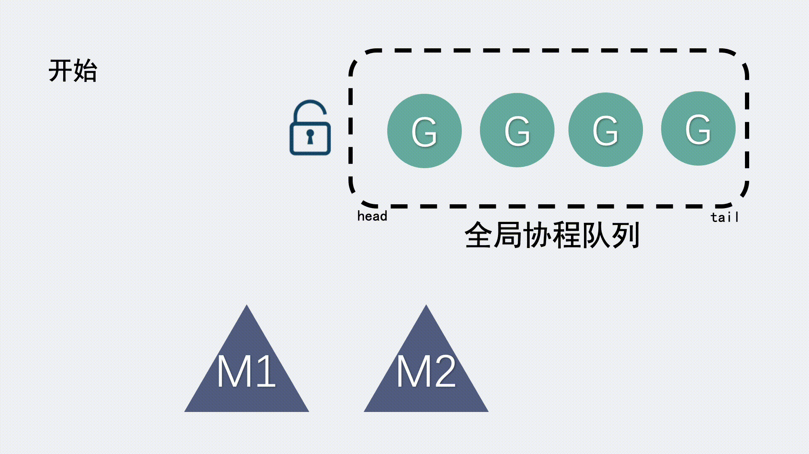
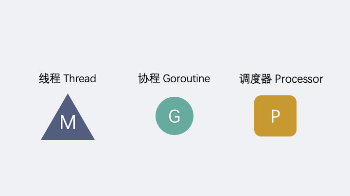
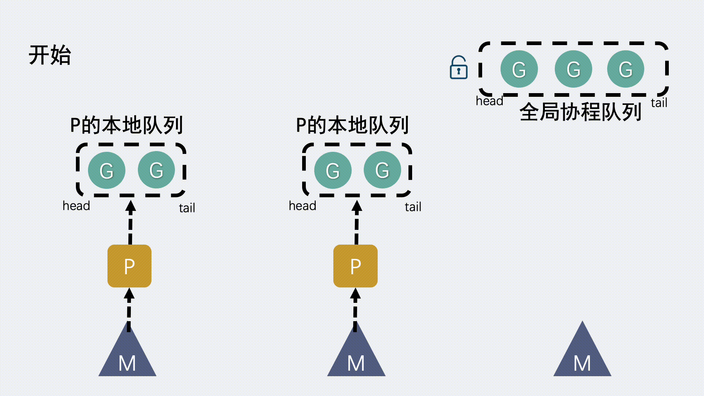
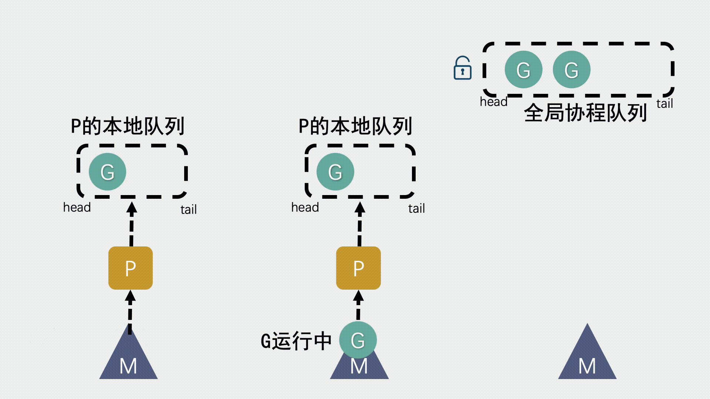
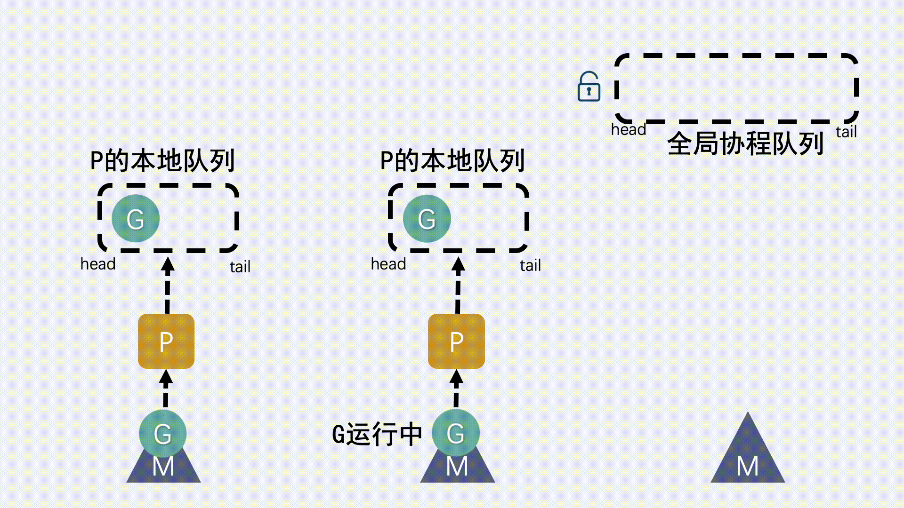

# GMP

## GM模型

在go 1.1之前用的是GM模型，后面才是GMP模型。GM模型处理G和M之外还有一个全局队列，全局队列用来存放可运行状态的G。M如果想获取到G就需要访问全局队列，那么多个M同时访问就会存在并发问题，所以M进行返回的时候就会对全局队列进行加锁，这时候全局队列就会被一把大锁锁住，并发量大的话会造成性能瓶颈。

## gmp模型是什么

- G：goroutine，用户态线程，有自己对的栈，instruction pointer和其他信息（正在等待的channel等），用于调度
- M：系统内核线程，操作系统是看不见G和P的，只知道自己在执行一个线程，G和P是在用户层上实现的
- P：调度器processor，代表执行所需要的资源（调度的上下文，队列等），实现从N:1到N:M的关键

所以为了解决这个全局大锁的问题，加入了P调度器，P为本地的协程队列也是用来存放G的，想要获取等待运行的G会优先从本地队列里面拿，访问本地队列无需加锁，而全局队列依然是存在的，但是功能会被弱化，只有本地队列也为空的情况下才回到全局队列中去拿G.

新建G时，新的G会优先加入到P的本地队列中，如果本地队列满了，就会从本地队列中的一半G移动到全局队列。

当P的本地队列为空时M就会去全局队列中去拿取。如果全局队列也为空，M就会从其他P的本地队列中stealing一半G放到自己的P的本地队列中。

## Goroutine的状态

- idle:空闲，表示goroutine为被调度执行
- runnable：可运行，表示goroutine已准备好运行，等待被标度到M上
- running：运行中，表示goroutine在一个M上运行
- syscall:系统调用，表示goroutine正在执行阻塞等待系统调用
- waiting:等待，表示goroutine正在等待某个事件
- dead：死亡，表示goroutine已被执行完成或被终止
