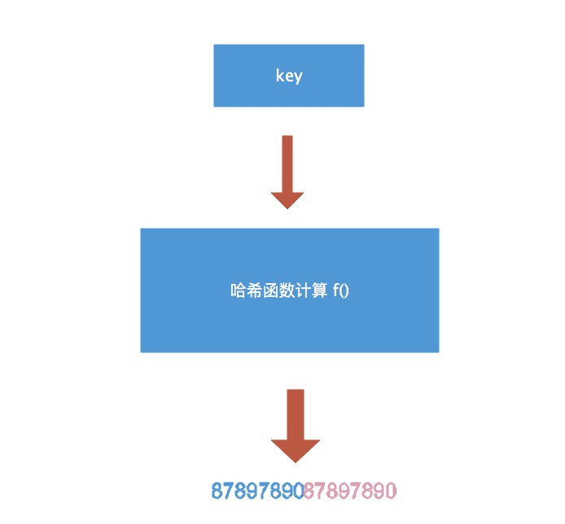

# map


> [map](https://www.cnblogs.com/qcrao-2018/p/10903807.html#map-%E5%86%85%E5%AD%98%E6%A8%A1%E5%9E%8B)

## map底层结构

map的底层实现式一个hash表（数组+链表），使用拉链法消除hash冲突。

```go
type hmap struct{
  //元素个数，调用len(map)返回长度
  count int
  //bucket数量是2^B，最多可以存放loadFactor * 2^B,再多就要扩容了
  B uint8 
  //hash seed
  hash0 uint32
  //指向bucket数组的指针(存放key val)；大小2^B
  buckets unsafe.Pointer
  //扩容时，buckets长度时oldbuckets的两倍
  oldbuckets unsafe.Pointer
}

type bmap struct{
  //高位hash值数组
  topbits [8]uint8
  //存储key的数组
  keys [8]keytype 
  //存储val的数组
  values [8]keytype
  //指向当前bucket的溢出桶
  overflow uintptr 
  //为了缓解当存在多个key计算后的hash值低8位相同的个数大于一个bucket所能存放的数目8个时，且这个map还没达到扩容条件时，做的一种存储设计。
}


```


主要涉及结构体有两个，一个`hamp`，一个`bmap`

对于`hamp`的buckets,他是`bmap`数组的指针。


对于`bmap`：

- topbits数组记录的是当前bucket中key的高8位
- overflow是指向哈希冲突时bucket满了，新构建出的bucket的指针。每个bmap的bucket最多只能放8个k-v键值对。如果碰巧有bucket存满了就需要构建出一个新的bucket并通过overflow指针连接起来，使得bucket形成一个链表。


## map查找过程



对于传进来的key值hash后key 经过哈希计算后得到哈希值，共 64 个 bit 位，计算它到底要落在哪个桶时会用到最后 B 个 bit 位。再用哈希值的高 8 位，找到此 key 在 bucket 中的位置，这是在寻找已有的 key。如果没有key或者找不到，就会找到第一个空位放入，如果找到了就会修改val的值。如果bucket桶满了，就会创建新的bmap，放到新的bmap中，使用overflow链接起来。

## map扩容过程

使用hash map的目的就是为了快速找到目标key、value，但是随着map中key越来越多，key发生hash碰撞的概率会越来越大，每个bucket的bmap8个位置都被塞满，甚至有的已经构建起来长长的链表，查找、插入、删除key的效率越来越低，所以bucket需要进行扩容了，减少key聚集在同一个bucket的情况。

map 扩容的时机：

1. 装载因子超过阈值，源码里定义的阈值是 6.5`（装载因子loadFactor := count / (2^B)）`
2. overflow 的 bucket 数量过多：
   1. 当 B 小于 15，也就是 bucket 总数 2^B 小于 2^15 时，如果 overflow 的 bucket 数量超过 2^B；
   2. 当 B >= 15，也就是 bucket 总数 2^B 大于等于 2^15，如果 overflow 的 bucket 数量超过 2^15

## 并发map

加sync.Mutex、sync.RWMutex


分片加锁，类似currentMap


sync.map