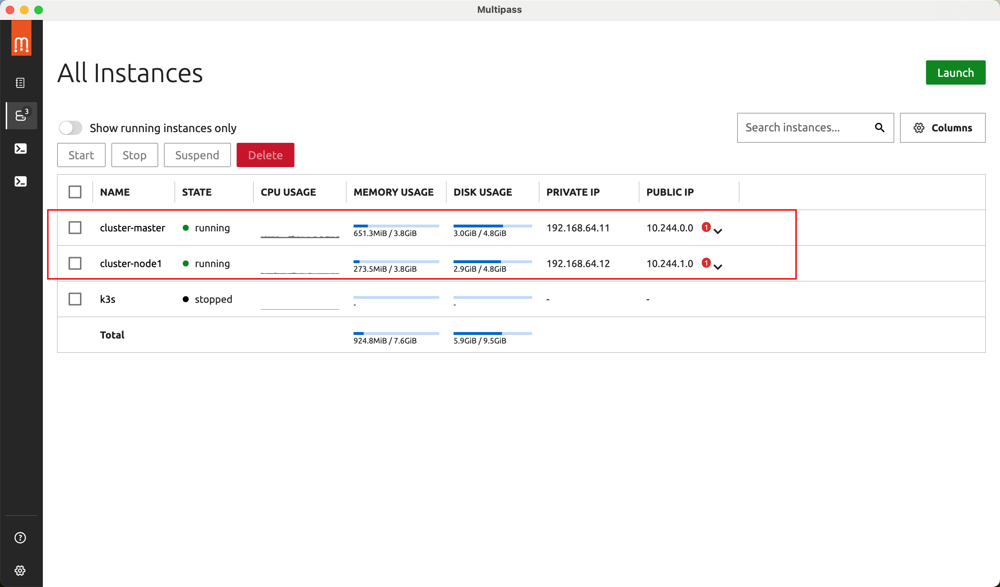
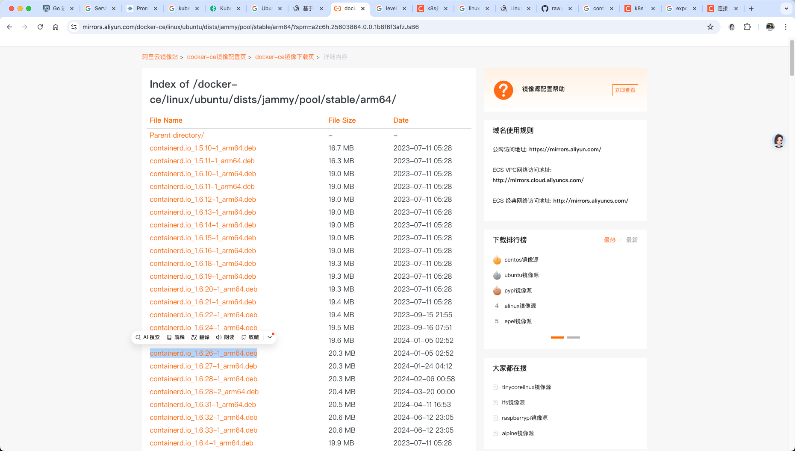
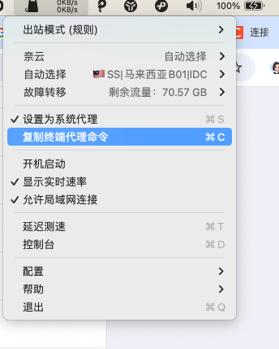

---
 
date: 2024-08-22
category:
  - planlearn
tag:
  - multipass
---
# multipass 安装部署k8s集群

## 什么是multipass？

众所周知[multipass](https://www.mobaijun.com/posts/3701652676.html) 是 mac 平台上一个可以虚拟化 ubuntu 操作系统的轻量化工具。几行命令就可以生成一个 Ubuntu 系统，搭配学习、测试使用非常方便。

那就引发了在 multipass 虚拟化的操作系统上需要搭建k8s 集群的需求了。

又因为 m2 是 arm64 芯片的缘故，网上的很多教程都不适用，我也是在摸索了许久之后才把 k8s 集群给搭建起来，该blog为记录。

之前尝试过使用一键配置工具[kubekey](https://kubesphere.io/zh/docs/v3.4/installing-on-linux/introduction/kubekey/)，但是最后还是失败了。目前记录[kubeadm](https://kubernetes.io/docs/reference/setup-tools/kubeadm/) 部署安装的细节。

## 初始化虚拟机

资源有限，先初始化两台机子，这也是大部分公司刚起步的情况，即使正确推荐是三台机子。甚至 mater 也需要设置多台。

```shell
multipass launch --name cluster-master --cpus 2 --mem 4096M --disk 5G
multipass launch --name cluster-node01 --cpus 2 --mem 2048M --disk 5G
```


## Ubuntu环境设置

以 cluster-master为例，cluster-node01操作相同

```shell
#关闭swap和防火墙
swapoff -a
sed -i '/swap/s/^/#/' /etc/fstab

#开启IPv4转发
cat <<EOF | sudo tee /etc/sysctl.d/k8s.conf
net.bridge.bridge-nf-call-iptables  = 1
net.bridge.bridge-nf-call-ip6tables = 1
net.ipv4.ip_forward                 = 1
EOF

echo '1' | sudo tee /proc/sys/net/bridge/bridge-nf-call-iptables

sudo vim /etc/sysctl.conf
#在文件的末尾添加以下两行配置
net.bridge.bridge-nf-call-iptables = 1 
net.ipv4.ip_forward = 1

sudo vim /etc/modules-load.d/br_netfilter.conf
#在文件中添加以下内容：
br_netfilter
```

## 安装containerd

```shell
#具体操作系统和版本可以点击链接去网页里面选择
curl -# -O  https://mirrors.aliyun.com/docker-ce/linux/ubuntu/dists/jammy/pool/stable/arm64/containerd.io_1.6.26-1_arm64.deb

#下载完成后安装
dpkg -i containerd.io_1.6.26-1_arm64.deb

#导出默认配置
containerd config default > /etc/containerd/config.toml
```



### 修改config.toml配置为如下

```toml
disabled_plugins = []
imports = []
oom_score = 0
plugin_dir = ""
required_plugins = []
root = "/var/lib/containerd"
state = "/run/containerd"
temp = ""
version = 2
 
[cgroup]
  path = ""
 
[debug]
  address = ""
  format = ""
  gid = 0
  level = ""
  uid = 0
 
[grpc]
  address = "/run/containerd/containerd.sock"
  gid = 0
  max_recv_message_size = 16777216
  max_send_message_size = 16777216
  tcp_address = ""
  tcp_tls_ca = ""
  tcp_tls_cert = ""
  tcp_tls_key = ""
  uid = 0
 
[metrics]
  address = ""
  grpc_histogram = false
 
[plugins]
 
  [plugins."io.containerd.gc.v1.scheduler"]
    deletion_threshold = 0
    mutation_threshold = 100
    pause_threshold = 0.02
    schedule_delay = "0s"
    startup_delay = "100ms"
 
  [plugins."io.containerd.grpc.v1.cri"]
    device_ownership_from_security_context = false
    disable_apparmor = false
    disable_cgroup = false
    disable_hugetlb_controller = true
    disable_proc_mount = false
    disable_tcp_service = true
    enable_selinux = false
    enable_tls_streaming = false
    enable_unprivileged_icmp = false
    enable_unprivileged_ports = false
    ignore_image_defined_volumes = false
    max_concurrent_downloads = 3
    max_container_log_line_size = 16384
    netns_mounts_under_state_dir = false
    restrict_oom_score_adj = false
    sandbox_image = "registry.aliyuncs.com/google_containers/pause:3.7"
    selinux_category_range = 1024
    stats_collect_period = 10
    stream_idle_timeout = "4h0m0s"
    stream_server_address = "127.0.0.1"
    stream_server_port = "0"
    systemd_cgroup = false
    tolerate_missing_hugetlb_controller = true
    unset_seccomp_profile = ""
 
    [plugins."io.containerd.grpc.v1.cri".cni]
      bin_dir = "/opt/cni/bin"
      conf_dir = "/etc/cni/net.d"
      conf_template = ""
      ip_pref = ""
      max_conf_num = 1
 
    [plugins."io.containerd.grpc.v1.cri".containerd]
      default_runtime_name = "runc"
      disable_snapshot_annotations = true
      discard_unpacked_layers = false
      ignore_rdt_not_enabled_errors = false
      no_pivot = false
      snapshotter = "overlayfs"
 
      [plugins."io.containerd.grpc.v1.cri".containerd.default_runtime]
        base_runtime_spec = ""
        cni_conf_dir = ""
        cni_max_conf_num = 0
        container_annotations = []
        pod_annotations = []
        privileged_without_host_devices = false
        runtime_engine = ""
        runtime_path = ""
        runtime_root = ""
        runtime_type = ""
 
        [plugins."io.containerd.grpc.v1.cri".containerd.default_runtime.options]
 
      [plugins."io.containerd.grpc.v1.cri".containerd.runtimes]
 
        [plugins."io.containerd.grpc.v1.cri".containerd.runtimes.runc]
          base_runtime_spec = ""
          cni_conf_dir = ""
          cni_max_conf_num = 0
          container_annotations = []
          pod_annotations = []
          privileged_without_host_devices = false
          runtime_engine = ""
          runtime_path = ""
          runtime_root = ""
          runtime_type = "io.containerd.runc.v2"
 
          [plugins."io.containerd.grpc.v1.cri".containerd.runtimes.runc.options]
            BinaryName = ""
            CriuImagePath = ""
            CriuPath = ""
            CriuWorkPath = ""
            IoGid = 0
            IoUid = 0
            NoNewKeyring = false
            NoPivotRoot = false
            Root = ""
            ShimCgroup = ""
            SystemdCgroup = true
 
      [plugins."io.containerd.grpc.v1.cri".containerd.untrusted_workload_runtime]
        base_runtime_spec = ""
        cni_conf_dir = ""
        cni_max_conf_num = 0
        container_annotations = []
        pod_annotations = []
        privileged_without_host_devices = false
        runtime_engine = ""
        runtime_path = ""
        runtime_root = ""
        runtime_type = ""
 
        [plugins."io.containerd.grpc.v1.cri".containerd.untrusted_workload_runtime.options]
 
    [plugins."io.containerd.grpc.v1.cri".image_decryption]
      key_model = "node"
 
    [plugins."io.containerd.grpc.v1.cri".registry]
      config_path = ""
 
      [plugins."io.containerd.grpc.v1.cri".registry.auths]
 
      [plugins."io.containerd.grpc.v1.cri".registry.configs]
        [plugins."io.containerd.grpc.v1.cri".registry.configs."192.168.40.62".tls]
            insecure_skip_verify = true
        [plugins."io.containerd.grpc.v1.cri".registry.configs."192.168.40.62".auth]
            username = "admin"
            password = "Harbor12345"
 
      [plugins."io.containerd.grpc.v1.cri".registry.headers]
 
      [plugins."io.containerd.grpc.v1.cri".registry.mirrors]
         [plugins."io.containerd.grpc.v1.cri".registry.mirrors."192.168.40.62"]
            endpoint = ["https://192.168.40.62:443"]
          [plugins."io.containerd.grpc.v1.cri".registry.mirrors."docker.io"]
             endpoint = ["https://vh3bm52y.mirror.aliyuncs.com","https://registry.docker-cn.com"]
 
    [plugins."io.containerd.grpc.v1.cri".x509_key_pair_streaming]
      tls_cert_file = ""
      tls_key_file = ""
 
  [plugins."io.containerd.internal.v1.opt"]
    path = "/opt/containerd"
 
  [plugins."io.containerd.internal.v1.restart"]
    interval = "10s"
 
  [plugins."io.containerd.internal.v1.tracing"]
    sampling_ratio = 1.0
    service_name = "containerd"
 
  [plugins."io.containerd.metadata.v1.bolt"]
    content_sharing_policy = "shared"
 
  [plugins."io.containerd.monitor.v1.cgroups"]
    no_prometheus = false
 
  [plugins."io.containerd.runtime.v1.linux"]
    no_shim = false
    runtime = "runc"
    runtime_root = ""
    shim = "containerd-shim"
    shim_debug = false
 
  [plugins."io.containerd.runtime.v2.task"]
    platforms = ["linux/amd64"]
    sched_core = false
 
  [plugins."io.containerd.service.v1.diff-service"]
    default = ["walking"]
 
  [plugins."io.containerd.service.v1.tasks-service"]
    rdt_config_file = ""
 
  [plugins."io.containerd.snapshotter.v1.aufs"]
    root_path = ""
 
  [plugins."io.containerd.snapshotter.v1.btrfs"]
    root_path = ""
 
  [plugins."io.containerd.snapshotter.v1.devmapper"]
    async_remove = false
    base_image_size = ""
    discard_blocks = false
    fs_options = ""
    fs_type = ""
    pool_name = ""
    root_path = ""
 
  [plugins."io.containerd.snapshotter.v1.native"]
    root_path = ""
 
  [plugins."io.containerd.snapshotter.v1.overlayfs"]
    root_path = ""
    upperdir_label = false
 
  [plugins."io.containerd.snapshotter.v1.zfs"]
    root_path = ""
 
  [plugins."io.containerd.tracing.processor.v1.otlp"]
    endpoint = ""
    insecure = false
    protocol = ""
 
[proxy_plugins]
 
[stream_processors]
 
  [stream_processors."io.containerd.ocicrypt.decoder.v1.tar"]
    accepts = ["application/vnd.oci.image.layer.v1.tar+encrypted"]
    args = ["--decryption-keys-path", "/etc/containerd/ocicrypt/keys"]
    env = ["OCICRYPT_KEYPROVIDER_CONFIG=/etc/containerd/ocicrypt/ocicrypt_keyprovider.conf"]
    path = "ctd-decoder"
    returns = "application/vnd.oci.image.layer.v1.tar"
 
  [stream_processors."io.containerd.ocicrypt.decoder.v1.tar.gzip"]
    accepts = ["application/vnd.oci.image.layer.v1.tar+gzip+encrypted"]
    args = ["--decryption-keys-path", "/etc/containerd/ocicrypt/keys"]
    env = ["OCICRYPT_KEYPROVIDER_CONFIG=/etc/containerd/ocicrypt/ocicrypt_keyprovider.conf"]
    path = "ctd-decoder"
    returns = "application/vnd.oci.image.layer.v1.tar+gzip"
 
[timeouts]
  "io.containerd.timeout.bolt.open" = "0s"
  "io.containerd.timeout.shim.cleanup" = "5s"
  "io.containerd.timeout.shim.load" = "5s"
  "io.containerd.timeout.shim.shutdown" = "3s"
  "io.containerd.timeout.task.state" = "2s"
 
[ttrpc]
  address = ""
  gid = 0
  uid = 0
```

### 重启 containerd 服务

```shell
#启动containerd服务
systemctl enable containerd
systemctl restart containerd
```

## 安装kubuadm、kubelet、kubectl

```shell
apt update && apt install -y apt-transport-https curl

curl -fsSL https://mirrors.aliyun.com/kubernetes/apt/doc/apt-key.gpg | apt-key add -

cat <<EOF >/etc/apt/sources.list.d/kubernetes.list
deb https://mirrors.aliyun.com/kubernetes/apt/ kubernetes-xenial main
EOF

apt update
apt install -y kubelet kubeadm kubectl
systemctl enable kubelet
```


## 初始化master

### 拉取下载镜像

```shell
kubeadm config images pull --image-repository=registry.aliyuncs.com/google_containers --kubernetes-version="v1.28.2"
```

### 节点初始化

```shell
kubeadm init --kubernetes-version=v1.28.2 --pod-network-cidr=10.244.0.0/16 --service-cidr=10.96.0.0/12 --image-repository=registry.aliyuncs.com/google_containers --upload-certs
```

初始化成功后复制一下终端输出的 join token command后面加入node 节点的时候需要用到，例如：

```shell
kubeadm join 192.168.64.11:6443 --token 8t5yyu.v21j2vcjitjxhb4u \
--discovery-token-ca-cert-hash sha256:76e6565509b76c16874c27f157864fcd95a53d88fb9f00dd9ea2aeb7c7e31858
```

### 设置 kubectl 访问 kube-apiserver

```shell
#root 目录下
mkdir .kube
#拷贝访问密钥
cp -i /etc/kubernetes/admin.conf $HOME/.kube/config
kibectl get pod -A
```

## 部署网络flannel插件

```
wget https://raw.githubusercontent.com/coreos/flannel/master/Documentation/kube-flannel.yml
kubectl apply -f kube-flannel.yml
```

拉不下来网页范围链接拷贝后写文件。

containerd 拉去不下来就得换源或者配置代理，这里我提供配置代理的技巧拉去镜像。假设我们电脑上有 代理vpn 了，那么基本上代理的端口为7890，具体得看不同软件。我这里以 clashx 为例



```shell
#复制终端代理命令，并修改127.0.0.1为电脑的内网地址,虚拟机就可以通过这个内网 IP 和端口进行代理
#例192.168.0.105为我这台电脑上的 IP，虚拟机通过局域网内网链接
export https_proxy=http://192.168.0.105:7890 http_proxy=http://192.168.0.105:7890 all_proxy=socks5://192.168.0.105:7890
```

配置完代理后通过` ctr  -n k8s.io i pull docker.io/flannel/flannel:v0.25.6`下载拉去不下来的镜像，下载完成镜像后可以重置代理恢复初始化的代理配置`unset http_proxy https_proxy all_proxy`
