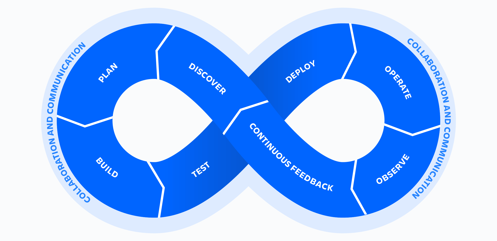

# devops

## what is devops

devops 是一种概念

devops 是实践、工具和文化理念的集合，目标是自动化和整合开发团队和 IT 团队之间的流程。强调团队赋权、跨团队和技术自动化。

因为当时软件开发和 IT 运维是分开的（即写代码的开发人员和部署与支持代码运维的人员是分开的两个角色），devops 是 development 和 operation 的组合，反映了将这两个领域的工作联合起来。

## devops 的运作方式

devops 团队包括开发人员和 IT 运维人员，在整个产品的迭代周期中协作，以提高软件的部署速度和交付质量。在 devops 模式下，开发和运维不会在孤立，两个团队会合并成一个团队，参与到这个产品的生命周期（开发、测试、部署、运维）并具备多岗位技能。

devops 的重要因素，持续集成、持续交付、自动化和协作。

DevOps 生命周期由八个阶段组成，代表了开发（循环的左半部分）和运维（循环的右半部分）所需的流程、功能和工具。在每个阶段中，团队进行协作和沟通，以保持一致性、速度和质量。

DevOps 生命周期由八个阶段组成，代表了开发（循环的左半部分）和运维（循环的右半部分）所需的流程、功能和工具。在每个阶段中，团队进行协作和沟通，以保持一致性、速度和质量。

- **发现**
  软件开发是一项团队运动。为了准备即将到来的冲刺（sprint），团队必须进行研讨会，探索、整理成员的创意并确定优先级。这些创意必须与战略目标相一致，并能产生客户影响。敏捷方法可以帮助指导 DevOps 团队。
- **规划**
  DevOps 团队应该采用敏捷实践来提高速度和质量。敏捷是一种用于项目管理和软件开发的迭代方法，帮助团队将工作分解成较小的部分，以提供增量价值。
- **构建**
  [Git](https://coding.net/docs/repo/manage/create.html) 是免费且开源的版本控制系统，提供分支管理、合并和重写存储库历史记录等能力。这也为开发构建流程带来了众多极具创新且功能强大的工作流和工具。
- **测试**
  持续集成 (CI) 允许多个开发人员向单个共享存储库贡献代码。当代码更改合并时，自动化测试会在集成之前运行以确保正确性。合并和测试代码通常有助于开发团队在部署后获得代码质量和可预测性的保证。
- **部署**
  持续部署 (CD)允许团队频繁地将功能自动发布到生产环境中。团队还可以选择部署功能标记，从而稳定、有条不紊地向用户交付新代码，而不是一次性全部交付。这种方法提高了软件开发团队的速度、生产力和可持续性。
- **运维**
  管理面向客户的端到端 IT 服务交付。这包括设计、实施、配置、部署和维护组织内 IT 基础架构过程中涉及的实践。

- **观察**
  快速识别和解决影响产品正常运行、效率和功能的问题。自动通知团队有关更改、高风险操作或故障信息，以便团队可以保持服务的运行。
- **持续反馈**
  DevOps 团队应该评估每个发布版本，并生成报告以改进未来版本。通过收集持续反馈，团队可以改进其流程并采纳客户反馈以改进下一个发布版本。

## 什么是持续集成（CI）

当提交了一部分修改完成的代码后，我们总是希望可以快速得到直观且有效的反馈，及早暴露问题。在开发过程中总有一部分工作是相对机械化，易出错的（例如打包、部署）。为何不将这部分工作交给机器来做呢？仅需要轻点鼠标，将部署与发布的事宜交由持续集成，把时间花在更有价值的事物上。

持续集成便是专门为此工作流而设计的得力功能。通过对每次提交的代码进行自动化的代码检查、单元测试、编译构建、甚至自动部署与发布，能够大大降低开发人员的工作负担，减少许多不必要的重复劳动，持续提升代码质量与开发效率。毫无疑问，持续集成是开发者与研发团队的福音。

## 什么是持续部署（CD）

持续部署指在软件开发过程中，以自动化方式，频繁而且持续性的将软件部署到生产环境，使软件产品能够快速的交付使用。作为持续集成的延伸，持续部署以上下游产品优势为根基，是实现 DevOps 闭环的最后流程。

持续部署用于把控构建之后的项目发布与部署交付流程。能够无缝对接上游 Git 仓库、下游制品仓库以实现全自动化部署。同时还支持 Webhook 等外部对接能力，高效集成各种开发、运维工具。在稳定的技术架构、运维工具等基础上，具备蓝绿发布，灰度发布（金丝雀发布），滚动发布，快速回滚等能力。