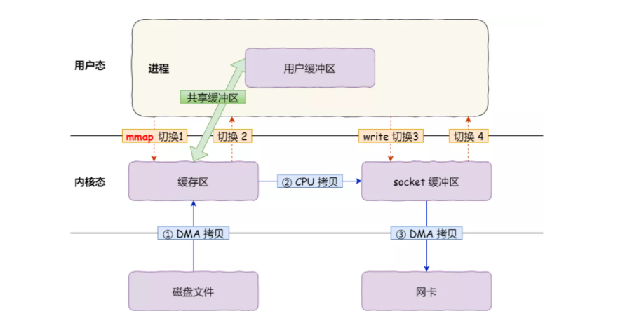

# 零拷贝

> 磁盘对比内存来说是相当慢的硬件了，所以很多优化方案都是减少对磁盘的访问，比如零拷贝、直接IO、异步IO等，这些优化的目的都是为了提供系统的吞吐量。

### 用户态和内核态

对于操作系统来说，创建一个进程是核心功能，创建进程需要做很多工作，比如分配物理内存，父子进程拷贝学习，拷贝设置页目录页表等等，这些最关键的工作得由特定的进程去做，这样可以做到集中管理，减少有限资源的访问和使用冲突。用户运行一个程序，该程序创建的进程开始运行自己的代码，如果要执行文件操作、网络数据发送等就必须通过write、read、send等系统调用，这些系统调用会调用内核的代码，进程会切换到特权级为0，然后进入内核地址空间去执行内核代码。

当一个进程在执行用户自己代码时出于用户态，此时该进程的特权等级最低为3级，是普通用户进程运行的特权级，特权状态为3的进程不能访问特权级为0的地址空间，包括代码和数据；当一个进程因为系统调用陷入到内核代码中执行时处于内核态，此时特权级最高，为0。每个进程都有自己的内核栈，执行的内核代码会使用当前进程的内核栈。

#### 用户态切换到内核态的三种方式：

**系统调用**，这是用户态进程主动要求切换到内核态的一种方式，用户态进程通过系统调用申请使用操作系统提供的服务程序完成工作。

**异常**，当CPU在执行运行在用户态下的程序时，发生了一些没有预知的异常这时会触发由当前运行进程切换到处理此异常的内核相关代码中

**外围设备中断**，当外围设备完成用户请求的操作后，会向CPU发出相应的中断信息，这时CPU会暂停执行下一条即将要执行的指令而转到与中断信号对应的处理程序去执行，如果前面执行的指令是用户态下的进程，那么转换的过程自然就是有用户态到内核态的切换，如磁盘读写操作完成，系统会切换回磁盘读写的中断处理程序中执行后面的操作。


### DMA技术

> DMA（Direct Memory Access）直接内存访问技术，简单理解就是在进行IO设备和内存的数据传输的时候，数据搬运的工作全部交给DMA控制器，而CPU不再参与任何与数据搬运相关的事情，这样CPU就可以去处理别的事务。

#### 在没有DMA技术前，IO操作的过程是这样的：

进程调用read()系统调用，进程从用户态切换到内核态，CPU发出指令给磁盘控制器然后返回；

磁盘控制器收到指令后，于是就开始准备数据，把数据放入磁盘控制器的缓冲区中，然后产生一个CPU中断；

CPU收到中断信号后就会暂停执行下一条即将要执行的指令而转到中断信号对应的处理程序中去执行；

CPU把磁盘控制器缓冲区的数据一个一个字节的读进自己的寄存器中的PageCache，

然后将Pagecache里面的数据写拷贝到用户缓冲区，随后该进程从内核态切换为用户态。

#### 使用DMA控制器进行数据传输的过程：

用户进程调用read()方法向操作系统发出IO请求，请求读取数据到自己的内存缓冲区，进程进入阻塞状态；

操作系统收到请求后，进一步将IO请求发送给DMA然后让CPU执行其他任务；

DMA进一步将IO请求发送给磁盘，磁盘收到DMA的IO请求后，把数据从磁盘读取到磁盘控制器的缓冲区中；

当磁盘控制器的缓冲区被读满后，向DMA发起中断信号，告知自己缓冲区已满；

DMA收到磁盘信号后，将磁盘控制器缓冲区中的数据拷贝到内核缓冲区中，此时不占用CPU，CPU可以执行其他任务‘

当DMA读取了足够多的数据，就会发送中断信号给CPU；

CPU收到DMA的信号知道数据已经准备好，于是将数据从内核拷贝到用户空间，系统调用返回。

整个数据的传输过程中，CPU不再参与数据的搬运工作，全程由DMA来完成，但是CPU在整个过程中也是必不可少的


### 文件传输的改进

#### 文件传输的问题

服务端要想提供文件传输的功能，最简单的方式就是将磁盘上的文件读取出来，然后通过网络协议发送给客户端。而在进程层面看的话其实会有4次用户态与内核态上下文切换的过程，

即进程调用read()读取磁盘文件时，进程会从用户态切换成内核态，通过DMA将磁盘上的文件拷贝到内核缓冲区

把内核缓冲区中的数据拷贝到用户缓冲区里后会将内核态切换为用户态，这个搬运数据的过程是需要CPU完成的

把用户缓冲区的数据拷贝到内核的socket缓冲区里，此时需要进程从用户态到内核态的切换并且这个过程也是需要CPU完成的。

把内核的socket缓冲区里的数据拷贝到网卡的缓冲区里，这个过程是由DMA完成的。

我们可以看到这个文件传输的过程中，数据搬运了四次，过多的数据拷贝会降低系统的性能。要提高文件传输的性能就要减少**用户态与内核态上下文的切换**和**内存拷贝的次数**。

#### 优化文件传输性能

读取磁盘数据的时候之所以要进行上下文切换是因为用户空间没有权限操作磁盘和网卡，内核的权限最高，这些操作设备的过程需要交给操作系统内核来完成，而一次系统调用必然会发生两次上下文切换：首先是从用户态到内核态，当内核态执行完任务后会切换会用户态。要想减少上下文切换的次数就要减少系统调用的次数。

文件传输方式会经历4次数据拷贝，而这里面中从内核的缓冲区拷贝到用户缓冲区再从用户缓冲区拷贝到socket缓冲区里，这个过程是没有必要的，我们应该想办法减少数据拷贝的次数。

### 零拷贝技术实现减少数据拷贝次数

#### mmap+write

我们知道read()系统调用会把内核缓冲区中的数据拷贝到用户缓冲区，于是为了减少这一开销我们可以用mmap()替换read()系统调用。



进程调用mmap()后，DMA会把磁盘的数据拷贝到内核缓冲区，进程用户和系统内核共享这个缓冲区；

进程再调用write()，操作系统直接将内核缓冲区的数据拷贝到socket缓冲区中，由CPU来搬运数据；

最后把内核socket缓冲区里的数据宝贝到网卡缓冲区里，这是由DMA来搬运的。

mmap()系统调用函数会直接把内核缓冲区里的数据映射到用户空间，这样内核就不需要与用户空间进行数据拷贝。

#### sendfile

```c
sendfile(int out_fd,int in_fd,off_t *offest,size_t count);
//前两个参数是目的端和源端文件描述符，
//后两个参数是源端的偏移量和复制数据的长度，
//返回值是实际复制数据的长度。
```

该系统调用，**可以直接把内核缓冲区里的数据拷贝到 socket 缓冲区里，不再拷贝到用户态**。但这不是真正的零拷贝技术，如果网卡支持SG-DMA技术，sendfile()系统调用可以通过DMA将磁盘上的数据拷贝到内核缓冲区，缓冲区描述符和数据长度传到socket缓冲区，此过程不需要将数据从操作系统内核缓冲区拷贝到socket缓冲区中。这里所谓的零拷贝技术是因为我们没有在内存层面去拷贝数据，也就是说全程没有CPU来搬运数据，所有数据都是通过DMA来进行传输的。


零拷贝技术的文件传输方式相比传统的文件传输方式减少了2次的上下文切换和数据拷贝次数，只需要2次上下文切换和数据拷贝次数就可以完成文件的传输，而且2次的数据拷贝过程都不需要CPU，2次都是由DMA进行搬运的。

### PageCache

文件传输的过程中，第一步就是需要先把初盘文件数据拷贝到内核缓冲区中，这个内核缓冲区实际上就是磁盘的高速缓存（PageCache）。读写磁盘相比读写内存的速度慢很多，所以我们要想办法把读写磁盘替换成读写内存，于是我们通过DMA把磁盘的数据搬运到内存中，这样就可以用读内存代替读磁盘。但是内存的空间比磁盘空间要小很多，内存注定只能拷贝磁盘里的一小部分数据。所以通常刚被访问的数据在短时间内再次被访问的概率很高，于是PageCache来缓存最近被访问的数据，当空间不足时淘汰最久未被访问的缓存。

所以读磁盘数据的时候优先是在PageCache中找，如果数据在PageCache则直接返回，如果没有，则在磁盘中读取，然后缓存到PageCache中。读取磁盘数据的时候，需要找到数据所在的位置，但是对于机械磁盘需要通过磁头旋转到数据所在的扇区，再开始顺序读取数据，这个旋转磁头的都做是比较耗时的。所以PageCache还有预读功能，假设read()方法每次只会读32KB字节，虽然read刚开始的时候只会读取0~32KB的字节，但是内核会把后面的32—64KB的数据也读取到PageCache中，这样读取后面32—64KB数据的成本就很低。